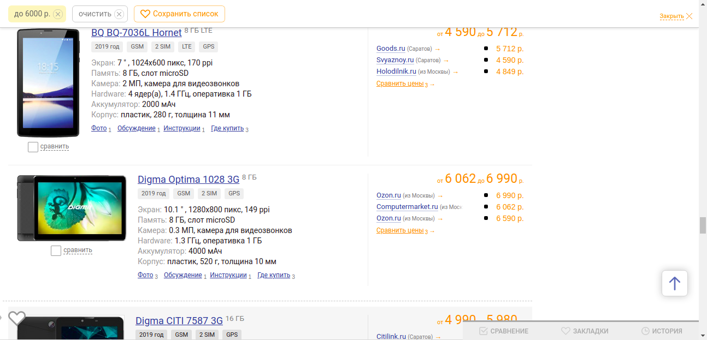
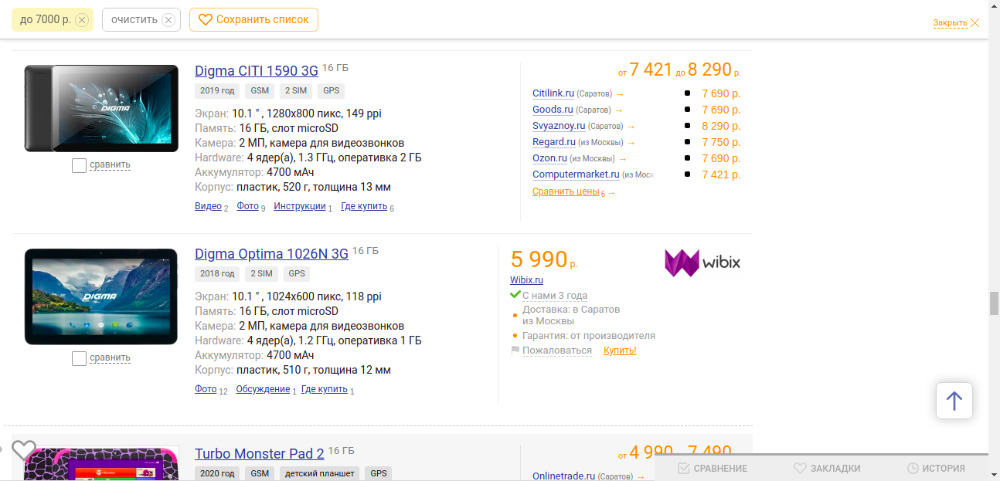
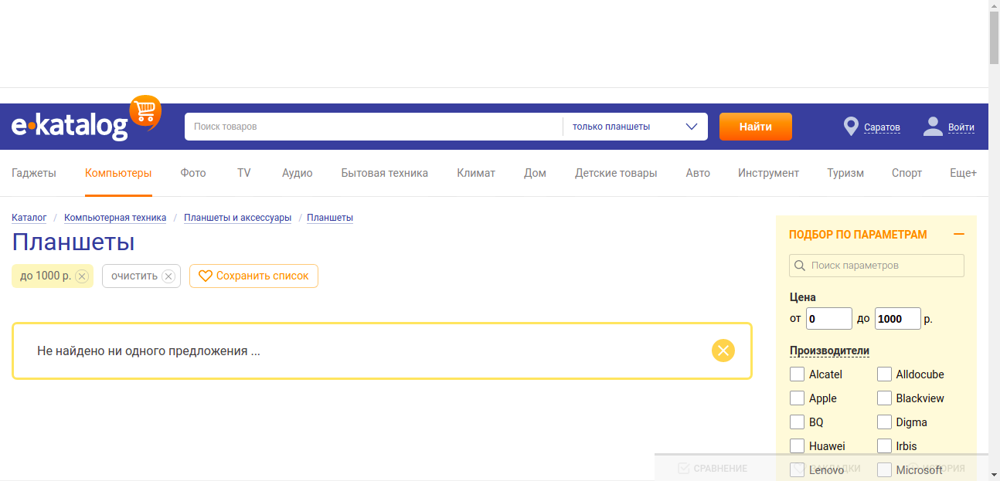

# Документация

## 1. Тест-план
1. Объектом тестирования является сайт `e-katalog.ru`
2. Список тестируемых функциональных единиц:
    1. проверка авторизации
    2. поиск товара
    3. проверка карточки товара
    4. добавление товара в список избранных
    5. проверка истории просмотров
    6. проверка фильтров поиска
3. Функциональное тестирование производится методом “черного ящика”.
Тестируемая среда – браузер Google Chrome. Проверка осуществляется только для
положительных кейсов основного функционала.
4. Тестирование не зависит от фаз разработки, так как проводится на готовом продукте.
Критерии начала тестирования: в любое время, когда `e-katalog.ru` доступен.
Критерии окончания тестирования: пройдены все тесты.
5. Используемые инструменты: `Python3`, `pytest`, `allure`, `selenium`.

## 2. Баг-репорт
### Bug report 1
Название | Пояснение 
-------|---------------------------
Описание (Summary)| Ошибки в работе фильтра по цене
Проект (Project) | `e-katalog.ru`
Компонент приложения (Component) | UI
Серьезность (Severity) | S3 Значительный (Major)
Приоритет (Priority) | P2 Средний (Medium)
Статус (Status) | Новый
Автор (Author) | Анастасия Степанова
Назначен на (Assigned to) | 
Окружение  (Environment) | `Ubuntu 20.10`, `Version 88.0.4324.96 (Official Build) (64-bit)`
Шаги воспроизведения (Steps to Reproduce) | Перейти на страницу `http://www.e-katalog.ru/k30.htm` (Компьютеры → Планшеты) -> В окне `Цена до` ввести `6000` -> Нажать кнопку “Подобрать”
Фактический Результат (Result) | В выдаче присутствуют планшеты с нижним диапозоном цены превышающий `6000 р.`
Ожидаемый результат (Expected Result) | В результате поиска присутствуют только планшеты, минимальная цена который меньше или равно указанному значению максимума цены

### Bug report 2
Название | Пояснение 
-------|---------------------------
Описание (Summary)| Ошибки в работе фильтра по цене
Проект (Project) | `e-katalog.ru`
Компонент приложения (Component) | UI
Серьезность (Severity) | S3 Значительный (Major)
Приоритет (Priority) | P2 Средний (Medium)
Статус (Status) | Новый
Автор (Author) | Анастасия Степанова
Назначен на (Assigned to) | 
Окружение  (Environment) | `Ubuntu 20.10`, `Version 88.0.4324.96 (Official Build) (64-bit)`
Шаги воспроизведения (Steps to Reproduce) | Перейти на страницу `http://www.e-katalog.ru/k30.htm` (Компьютеры → Планшеты) -> В окне `Цена до` ввести `7000` -> Нажать кнопку “Подобрать”
Фактический Результат (Result) | В выдаче присутствуют планшеты с нижним диапозоном цены превышающий `7000 р.`
Ожидаемый результат (Expected Result) | В результате поиска присутствуют только планшеты, минимальная цена который меньше или равно указанному значению максимума цены

### Bug report 3
Название | Пояснение 
-------|---------------------------
Описание (Summary)| Ошибки в работе фильтра по цене
Проект (Project) | `e-katalog.ru`
Компонент приложения (Component) | UI
Серьезность (Severity) | S3 Значительный (Major)
Приоритет (Priority) | P2 Средний (Medium)
Статус (Status) | Новый
Автор (Author) | Анастасия Степанова
Назначен на (Assigned to) | 
Окружение  (Environment) | `Ubuntu 20.10`, `Version 88.0.4324.96 (Official Build) (64-bit)`
Шаги воспроизведения (Steps to Reproduce) | Перейти на страницу `http://www.e-katalog.ru/k30.htm` (Компьютеры → Планшеты) -> В окне `Цена до` ввести `1000` -> Нажать кнопку “Подобрать”
Фактический Результат (Result) | Результат выдачи не содержит ни одного планшета
Ожидаемый результат (Expected Result) | В результате поиска присутствуют планшеты не дороже `1000`

